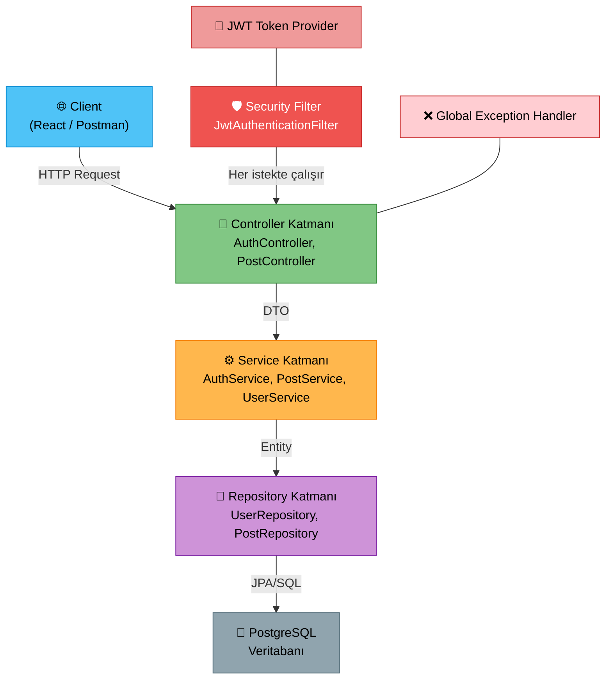
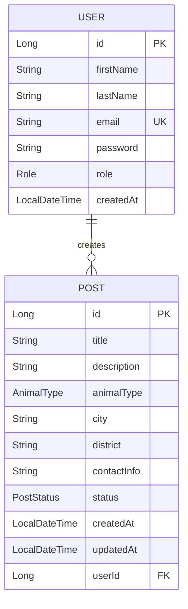

# LostPet AI - Proje Teknik Analiz ve Mimari Plan

## 📌 Proje Özeti

**LostPet AI**, kayıp evcil hayvanların ilanlarının oluşturulup yönetilebildiği, öğrenme odaklı bir full-stack projedir. Proje, Spring Boot ekosistemini adım adım öğrenmeyi hedefler. İlk aşamada (V1) temel CRUD operasyonları, kullanıcı yönetimi ve JWT authentication uygulanacaktır.

---

## 1. Kullanılacak Teknolojiler (V1)

| Katman | Teknoloji | Versiyon | Neden? |
|--------|-----------|----------|--------|
| **Dil** | Java | 21 (LTS) | En güncel uzun süreli destek sürümü, virtual threads, record patterns |
| **Framework** | Spring Boot | 3.x | Endüstri standardı, zengin ekosistem, kolay konfigürasyon |
| **Web** | Spring Web (MVC) | - | REST API geliştirmek için standart |
| **ORM** | Spring Data JPA + Hibernate | - | Veritabanı işlemlerini basitleştirir, SQL yazmadan CRUD |
| **Güvenlik** | Spring Security + JWT | - | Stateless authentication, modern API güvenliği |
| **Veritabanı** | PostgreSQL | 16+ | Production-grade, açık kaynak, JSON desteği |
| **Validasyon** | Jakarta Validation | - | Annotation tabanlı input doğrulama |
| **Dokümantasyon** | Swagger / SpringDoc OpenAPI | - | Otomatik API dokümantasyonu |
| **Yardımcı** | Lombok | - | Boilerplate kodu azaltır (getter/setter/constructor) |
| **Build Tool** | Maven | - | Bağımlılık yönetimi, proje yapılandırması |
| **DevOps** | Git + Docker | - | Versiyon kontrolü ve konteynerizasyon |

---

## 2. Proje Klasör Yapısı

```
Lost-Pet/
├── 📄 LostPetAI_Proje_Dokumani_Guncel.md
├── 📁 lostpet-backend/                          # Spring Boot Ana Projesi
│   ├── 📄 pom.xml                                # Maven bağımlılıkları
│   ├── 📄 Dockerfile
│   ├── 📄 docker-compose.yml
│   ├── 📄 .gitignore
│   ├── 📄 README.md
│   └── 📁 src/
│       ├── 📁 main/
│       │   ├── 📁 java/com/lostpet/
│       │   │   ├── 📄 LostPetApplication.java      # Ana başlatıcı sınıf
│       │   │   │
│       │   │   ├── 📁 config/                       # Konfigürasyon sınıfları
│       │   │   │   ├── 📄 SecurityConfig.java
│       │   │   │   ├── 📄 SwaggerConfig.java
│       │   │   │   └── 📄 CorsConfig.java
│       │   │   │
│       │   │   ├── 📁 controller/                   # REST Controller'lar
│       │   │   │   ├── 📄 AuthController.java
│       │   │   │   └── 📄 PostController.java
│       │   │   │
│       │   │   ├── 📁 service/                      # İş mantığı katmanı
│       │   │   │   ├── 📄 AuthService.java
│       │   │   │   ├── 📄 UserService.java
│       │   │   │   └── 📄 PostService.java
│       │   │   │
│       │   │   ├── 📁 repository/                   # Veritabanı erişim katmanı
│       │   │   │   ├── 📄 UserRepository.java
│       │   │   │   └── 📄 PostRepository.java
│       │   │   │
│       │   │   ├── 📁 entity/                       # JPA Entity sınıfları
│       │   │   │   ├── 📄 User.java
│       │   │   │   └── 📄 Post.java
│       │   │   │
│       │   │   ├── 📁 dto/                          # Data Transfer Object'ler
│       │   │   │   ├── 📁 request/
│       │   │   │   │   ├── 📄 RegisterRequest.java
│       │   │   │   │   ├── 📄 LoginRequest.java
│       │   │   │   │   ├── 📄 CreatePostRequest.java
│       │   │   │   │   └── 📄 UpdatePostRequest.java
│       │   │   │   └── 📁 response/
│       │   │   │       ├── 📄 AuthResponse.java
│       │   │   │       ├── 📄 PostResponse.java
│       │   │   │       ├── 📄 UserResponse.java
│       │   │   │       └── 📄 ApiResponse.java
│       │   │   │
│       │   │   ├── 📁 enums/                        # Enum tipleri
│       │   │   │   ├── 📄 AnimalType.java
│       │   │   │   ├── 📄 PostStatus.java
│       │   │   │   └── 📄 Role.java
│       │   │   │
│       │   │   ├── 📁 exception/                    # Hata yönetimi
│       │   │   │   ├── 📄 GlobalExceptionHandler.java
│       │   │   │   ├── 📄 ResourceNotFoundException.java
│       │   │   │   ├── 📄 UnauthorizedException.java
│       │   │   │   └── 📄 DuplicateResourceException.java
│       │   │   │
│       │   │   ├── 📁 security/                     # JWT ve güvenlik
│       │   │   │   ├── 📄 JwtTokenProvider.java
│       │   │   │   ├── 📄 JwtAuthenticationFilter.java
│       │   │   │   └── 📄 CustomUserDetailsService.java
│       │   │   │
│       │   │   └── 📁 mapper/                       # Entity ↔ DTO dönüştürücü
│       │   │       ├── 📄 UserMapper.java
│       │   │       └── 📄 PostMapper.java
│       │   │
│       │   └── 📁 resources/
│       │       ├── 📄 application.yml                # Ana konfigürasyon
│       │       ├── 📄 application-dev.yml            # Geliştirme ortamı
│       │       └── 📄 application-prod.yml           # Production ortamı
│       │
│       └── 📁 test/
│           └── 📁 java/com/lostpet/
│               ├── 📄 LostPetApplicationTests.java
│               └── 📁 service/
│                   └── 📄 PostServiceTest.java
└── 📁 docs/                                         # Proje dokümanları
    └── 📄 api-endpoints.md
```

---

## 3. Paket (Package) Yapısı

```
com.lostpet
├── config          → Uygulama konfigürasyonları (Security, CORS, Swagger)
├── controller      → HTTP isteklerini karşılayan REST endpoint'leri
├── service         → İş mantığı (business logic)
├── repository      → Spring Data JPA interface'leri (veritabanı erişimi)
├── entity          → JPA Entity sınıfları (veritabanı tabloları)
├── dto             → Data Transfer Object'ler (request/response)
│   ├── request     → Client'tan gelen veri modelleri
│   └── response    → Client'a dönen veri modelleri
├── enums           → Sabit değer kümeleri (AnimalType, PostStatus, Role)
├── exception       → Özel hata sınıfları ve global hata yöneticisi
├── security        → JWT token üretimi, doğrulaması ve filter
└── mapper          → Entity ↔ DTO dönüşüm sınıfları
```

---

## 4. Katmanlı Mimari (Layered Architecture)

Proje **3-Katmanlı Mimari (3-Tier Architecture)** kullanacaktır:



### Katmanların Sorumlulukları

| Katman | Sorumluluk | Örnek |
|--------|-----------|-------|
| **Controller** | HTTP isteklerini alır, DTO'yu alıp Service'e iletir, yanıtı döner | `@PostMapping("/api/posts")` |
| **Service** | İş mantığını uygular, validasyon yapar, Entity ↔ DTO dönüşümü | Kullanıcının kendi ilanını silmesi kontrolü |
| **Repository** | Veritabanı CRUD işlemlerini gerçekleştirir | `findByCity(String city)` |
| **Entity** | Veritabanı tablolarını Java sınıfı olarak temsil eder | `@Entity @Table(name = "posts")` |
| **DTO** | İstemci ile sunucu arasındaki veri taşıyıcı | `CreatePostRequest`, `PostResponse` |
| **Security** | JWT token yönetimi, authentication filter | Token üretme, doğrulama |
| **Exception** | Merkezi hata yakalama ve anlamlı HTTP yanıtları | `404 Not Found`, `400 Bad Request` |

### Veri Akışı

```
Client → Controller → Service → Repository → Database
                         ↕
                    DTO ↔ Entity (Mapper)
```

**Kural:** Controller asla doğrudan Repository'ye erişmez. Her katman yalnızca bir alt katmanla konuşur.

---

## 5. Bu Yapıyı Neden Seçtim?

### 🎯 Layered Architecture (Katmanlı Mimari)

| Neden | Açıklama |
|-------|----------|
| **Öğrenme dostu** | Her katmanın tek bir sorumluluğu var, kavramlar net ayrışıyor |
| **Endüstri standardı** | Kurumsal Java projelerinin %90+'ı bu yapıyı kullanır |
| **Kolay debug** | Hata hangi katmanda olduğunu kolayca tespit edebilirsin |
| **Ölçeklenebilir** | V2-V4'e geçerken yapıyı bozmadan yeni özellikler eklenebilir |
| **Test edilebilir** | Service katmanı bağımsız test edilebilir (Unit Test) |
| **Separation of Concerns** | Her sınıf tek bir iş yapar (Single Responsibility Principle) |

### 🎯 DTO Pattern Kullanımı

| Neden | Açıklama |
|-------|----------|
| **Güvenlik** | Entity'nin tüm alanlarını dışarıya açmaz (password gibi) |
| **Esneklik** | API yanıtı ile veritabanı yapısını bağımsız değiştirebilirsin |
| **Validasyon** | Request DTO üzerinde `@NotBlank`, `@Email` gibi kontroller |

### 🎯 Maven Build Tool

| Neden | Açıklama |
|-------|----------|
| **Yaygınlık** | Spring Boot ile en çok kullanılan build tool |
| **Kolay bağımlılık yönetimi** | `pom.xml` ile tüm kütüphaneler merkezi yönetilir |
| **Spring Initializr uyumu** | Proje oluşturma kolaylığı |

---

## 6. Entity İlişkileri (ER Diyagramı)



---

## 7. API Endpoint Planı (V1)

### Auth Endpoints

| Method | Endpoint | Açıklama | Auth |
|--------|----------|----------|------|
| `POST` | `/api/auth/register` | Kullanıcı kaydı | ❌ |
| `POST` | `/api/auth/login` | Giriş yap, JWT al | ❌ |

### Post (İlan) Endpoints

| Method | Endpoint | Açıklama | Auth |
|--------|----------|----------|------|
| `POST` | `/api/posts` | Yeni ilan oluştur | ✅ |
| `GET` | `/api/posts` | Tüm ilanları listele | ❌ |
| `GET` | `/api/posts/{id}` | İlan detayı | ❌ |
| `PUT` | `/api/posts/{id}` | İlan güncelle | ✅ (Owner) |
| `DELETE` | `/api/posts/{id}` | İlan sil | ✅ (Owner) |
| `GET` | `/api/posts/my` | Kendi ilanlarım | ✅ |

---

## Doğrulama Planı

### Manuel Doğrulama
- Postman ile tüm endpoint'ler test edilecek
- Swagger UI üzerinden API dokümantasyonu kontrol edilecek
- Docker Compose ile uygulama ayağa kaldırılıp test edilecek

---

## Açık Sorular

> [!IMPORTANT]
> **1. Java 21 kurulu mu?** Makinende Java 21 JDK kurulu olduğundan emin olalım. Kurulu değilse ilk adımda kurmamız gerekir.

> [!IMPORTANT]
> **2. PostgreSQL kurulumu:** PostgreSQL'i doğrudan mı yoksa Docker üzerinden mi çalıştırmak istersin? Docker ile çalıştırmak daha pratik olur.

> [!IMPORTANT]
> **3. Maven mı Gradle mı?** Dokümanda belirtilmemiş, Maven öneriyorum ama Gradle tercih edersen yapıyı ona göre ayarlayabilirim.

> [!NOTE]
> **4. IDE:** IntelliJ IDEA kullanıyor musun? Proje yapısını IDE'ye göre optimize edebilirim.
